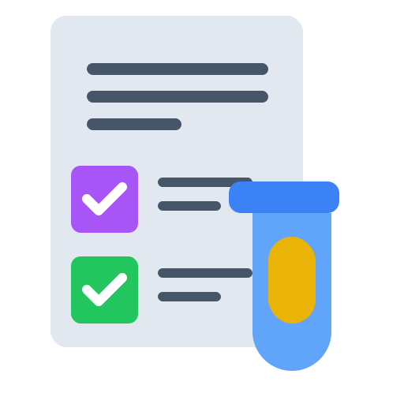
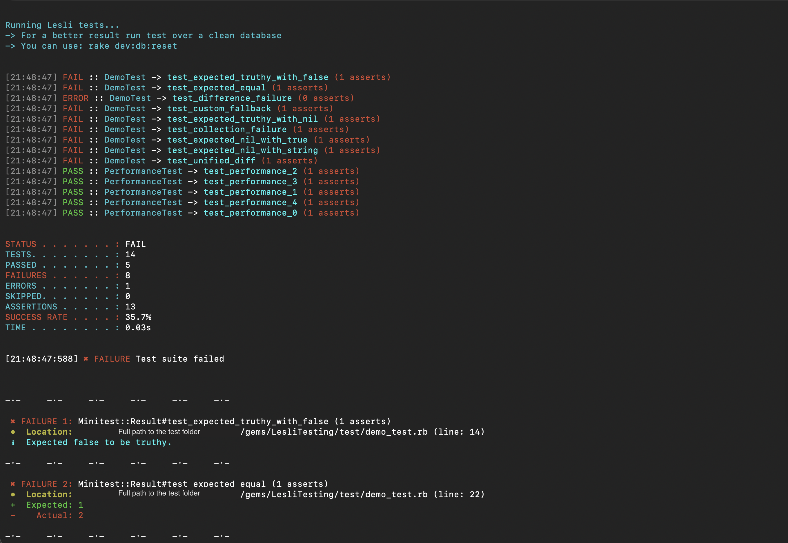

<div align="center">
    <h1 align="center">
        
    </h1>
    <h3 align="center">Shared testing, reporting, and coverage tools for the Lesli Framework.</h3>
</div>

<br />

<div align="center">
    <a target="_blank" href="https://github.com/LesliTech/LesliTesting/actions/workflows/main.yml">
        
    </a>
    <a target="_blank" href="https://rubygems.org/gems/lesli_testing">
        
    </a>
    <a target="_blank" href="https://codecov.io/github/LesliTech/LesliTesting">
        
    </a>
    <a target="_blank" href="https://sonarcloud.io/project/overview?id=LesliTech_LesliTesting">
        
    </a>
</div>

<br />

<div align="center">
    
</div>

<br />

---

<br />

## Introduction

LesliTesting provides the shared test configuration used across the [Lesli Framework](https://github.com/LesliTech/Lesli).

It standardizes Minitest output, SimpleCov profiles, coverage reports, and fixture loading for Rails applications, engines, and Ruby gems.

<br />

## Features

- Profiles for Rails applications, engines, and Ruby gems
- Human-friendly Minitest terminal reporting
- SimpleCov HTML, console, and Cobertura reports
- Configurable minimum coverage
- Shared Lesli fixture loading
- CI-aware test and coverage output

<br />

## Installation

Add LesliTesting to the application:

```shell
bundle add lesli_testing
```

<br />

## Usage

### Configure the test suite

Require LesliTesting near the beginning of `test/test_helper.rb`, then choose the matching project profile:

```ruby
ENV["RAILS_ENV"] ||= "test"

require "lesli_testing"

LesliTesting.app("LesliBuilder")
# LesliTesting.engine("LesliShield")
# LesliTesting.gem("LesliDate")
```

### Coverage options

Pass configuration to the selected profile:

```ruby
LesliTesting.engine(
  "LesliShield",
  coverage_missing_len: 30,
  coverage_min_coverage: 80
)
```

| Option | Type | Default | Description |
| --- | --- | ---: | --- |
| `coverage_missing_len` | Integer | `25` | Minimum width for missing-coverage output. |
| `coverage_min_coverage` | Integer | `90` | Minimum expected coverage percentage. |

### Run tests

```shell
bin/rails test
COVERAGE=true bin/rails test
COVERAGE=true CI=true bin/rails test
```

Set `QUIET=true` to suppress the per-test lines printed by the custom reporter.

<br />

## Development

Clone the repository and install its dependencies:

```shell
git clone https://github.com/LesliTech/LesliTesting.git
cd LesliTesting
bundle install
```

To use local source from a Lesli development workspace, reference it from the host application's `Gemfile`:

```ruby
gem "lesli_testing", path: "gems/LesliTesting"
```

### Tests

Run the default test task from the LesliTesting directory:

```shell
bundle exec rake
```

<br />

## Documentation

- [Lesli website](https://www.lesli.dev/)
- [Documentation](https://www.lesli.dev/gems/testing/)
- [Release notes](https://github.com/LesliTech/LesliTesting/releases)
- [Issue tracker](https://github.com/LesliTech/LesliTesting/issues)
- [Source code](https://github.com/LesliTech/LesliTesting)

<br />

## Community

- [X: @LesliTech](https://x.com/LesliTech)
- [hello@lesli.tech](mailto:hello@lesli.tech)
- [https://www.lesli.tech](https://www.lesli.tech)

<br />

## License

Copyright (c) 2026, Lesli Technologies, S. A.

This program is free software: you can redistribute it and/or modify
it under the terms of the GNU General Public License as published by
the Free Software Foundation, either version 3 of the License, or
(at your option) any later version.

This program is distributed in the hope that it will be useful,
but WITHOUT ANY WARRANTY; without even the implied warranty of
MERCHANTABILITY or FITNESS FOR A PARTICULAR PURPOSE. See the
GNU General Public License for more details.

You should have received a copy of the GNU General Public License
along with this program. If not, see [https://www.gnu.org/licenses/](https://www.gnu.org/licenses/).

The complete license text is available in the [license file](./license).

---

<br />
<br />

<div align="center">
    
    <h3 align="center">The Open-Source SaaS Development Framework for Ruby on Rails.</h3>
</div>
