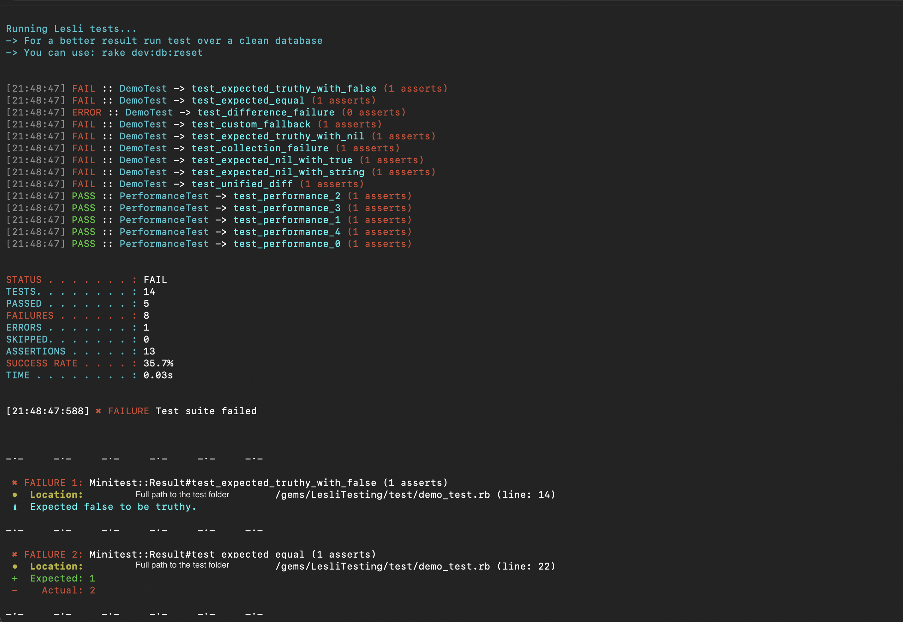

<div align="center">
    <h1 align="center">
        
    </h1>
    <h3 align="center">Shared testing, reporting, and coverage tools for the Lesli Framework.</h3>
</div>

<br />

<div align="center">
    <a target="_blank" href="https://github.com/LesliTech/LesliTesting/actions/workflows/main.yml">
        
    </a>
    <a target="_blank" href="https://rubygems.org/gems/lesli_testing">
        
    </a>
    <a target="_blank" href="https://codecov.io/github/LesliTech/LesliTesting">
        
    </a>
    <a target="_blank" href="https://sonarcloud.io/project/overview?id=LesliTech_LesliTesting">
        
    </a>
</div>

<br />

<div align="center">
    
</div>

<br />

---

<br />

## Introduction

LesliTesting provides the shared test configuration used across the [Lesli Framework](https://github.com/LesliTech/Lesli).

It standardizes Minitest output, SimpleCov profiles, coverage reports, and fixture loading for Rails applications, engines, and Ruby gems.

<br />

## Features

- Coverage profiles for Rails applications, Rails engines, and Ruby gems
- A human-friendly Minitest reporter with per-test timing and failure details
- SimpleCov HTML, console, and Cobertura reports
- Configurable minimum coverage thresholds
- Shared base classes for integration, model, and view tests
- Automatic access to Lesli fixtures in Rails test cases

<br />

## Installation

Add LesliTesting to the test group of your application, engine, or gem:

```shell
bundle add lesli_testing --group test
```

Alternatively, add it to the `Gemfile` and run `bundle install`:

```ruby
group :test do
  gem "lesli_testing"
end
```

<br />

## Usage

### Configure the test suite

Require LesliTesting from `test/test_helper.rb` after the Rails test environment is loaded, then select the profile that matches the project:

```ruby
ENV["RAILS_ENV"] ||= "test"
require_relative "../config/environment"
require "rails/test_help"

require "lesli_testing"

LesliTesting.app("LesliBuilder")
```

Choose one configuration method per test suite:

| Method | Use for | Coverage behavior |
| --- | --- | --- |
| `LesliTesting.app(name, options = {})` | A Rails application | Uses the Rails profile and tracks Ruby files in `app`, `lib`, `engines`, and `gems`. |
| `LesliTesting.engine(name, options = {})` | A Rails engine | Uses the Rails profile and excludes files under `test`. |
| `LesliTesting.gem(name, options = {})` | A Ruby gem | Tracks Ruby files under `lib` and applies the standard SimpleCov test filters. |

The supplied name becomes the SimpleCov command name. Use a stable, unique name so that coverage results can be identified and merged correctly.

### Testing a Ruby gem

LesliTesting can be used by standalone Ruby gems; Rails is not required. It provides the same Minitest reporter, coverage threshold, and HTML, console, and Cobertura coverage reports used by Lesli applications and engines. Rails-only test classes and fixture integration are skipped when Rails is not loaded.

Configure the gem in `test/test_helper.rb` before requiring the library under test. Starting LesliTesting first ensures that SimpleCov can observe files as they are loaded when `COVERAGE` is enabled:

```ruby
# test/test_helper.rb
$LOAD_PATH.unshift File.expand_path("../lib", __dir__)

require "lesli_testing"

LesliTesting.gem(
  "LesliDate",
  coverage_min_coverage: 90
)

require "minitest/autorun"
require "lesli_date"
```

Tests remain standard Minitest tests:

```ruby
# test/lesli_date_test.rb
require "test_helper"

class LesliDateTest < Minitest::Test
  def test_formats_a_date
    assert_equal "2026-09-26", LesliDate.format(Date.new(2026, 9, 26))
  end
end
```

For a gem using Rake, the following `Rakefile` makes the test suite the default task:

```ruby
require "bundler/gem_tasks"
require "minitest/test_task"

Minitest::TestTask.create

task default: :test
```

Run the suite normally or with coverage enabled:

```shell
bundle exec rake
COVERAGE=true bundle exec rake
QUIET=true COVERAGE=true bundle exec rake
```

### Shared test classes

Rails projects can inherit from the provided test classes:

```ruby
class AccountsControllerTest < LesliTesting::IntegrationTester
  def test_index_returns_json
    get accounts_url, as: :json

    expect_response_with_successful
    assert_kind_of Array, response_json
  end
end

class AccountTest < LesliTesting::ModelTester
  # Includes ActiveSupport::Testing::TimeHelpers.
end

class NavigationHelperTest < LesliTesting::ViewTester
  # Includes available Lesli HTML and system helpers.
end
```

`LesliTesting::IntegrationTester` provides two response helpers:

- `response_json` parses the response body as JSON and returns an empty hash for a blank body.
- `expect_response_with_successful` asserts a successful response with the `application/json; charset=utf-8` content type.

The Rails-specific classes are defined only when their corresponding Rails test classes have already been loaded. This is why `rails/test_help` must be required before configuring LesliTesting.

When the Lesli engine is available, LesliTesting also adds its fixture and file-fixture paths to `ActiveSupport::TestCase` and maps the `lesli_users` and `lesli_accounts` fixture sets to their namespaced models.

### Coverage options

Pass configuration to the selected profile:

```ruby
LesliTesting.engine(
  "LesliShield",
  coverage_missing_len: 30,
  coverage_min_coverage: 80
)
```

| Option | Type | Default | Description |
| --- | --- | ---: | --- |
| `coverage_missing_len` | Integer | `25` | Maximum number of characters shown for missing lines in console coverage output. Use `0` for no limit. |
| `coverage_min_coverage` | Numeric | `90` | Minimum required line-coverage percentage. The test command fails when coverage is lower. |

Coverage is disabled by default. Set `COVERAGE` to enable all three formatters:

- Console summary in the test output
- HTML report in `coverage/index.html`
- Cobertura XML report in `coverage/coverage.xml`

### Run tests

```shell
bin/rails test
COVERAGE=true bin/rails test
COVERAGE=true CI=true bin/rails test
```

For a Ruby gem, use `bundle exec rake` or `bundle exec ruby -Itest test/example_test.rb`.

The custom reporter prints each test result, assertion count, and tests that take longer than one second. Set `QUIET=true` to suppress the per-test lines while keeping the final summary and failure details.

`COVERAGE` and `QUIET` are enabled whenever the variables are present; leave them unset to disable their behavior.

<br />

## Development

Clone the repository and install its dependencies:

```shell
git clone https://github.com/LesliTech/LesliTesting.git
cd LesliTesting
bundle install
```

To use local source from a Lesli development workspace, reference it from the host application's `Gemfile`:

```ruby
gem "lesli_testing", path: "gems/LesliTesting"
```

### Tests

Run the default test task from the LesliTesting directory:

```shell
bundle exec rake
```

Run the reporter demonstration failures explicitly with `DEMO=true`:

```shell
DEMO=true bundle exec ruby -Itest test/demo_test.rb
```

The demo command is expected to fail and is intended for visually checking failure formatting.

<br />

## Documentation

- [Lesli website](https://www.lesli.dev/)
- [Documentation](https://www.lesli.dev/gems/testing/)
- [Release notes](https://github.com/LesliTech/LesliTesting/releases)
- [Issue tracker](https://github.com/LesliTech/LesliTesting/issues)
- [Source code](https://github.com/LesliTech/LesliTesting)

<br />

## Community

- [X: @LesliTech](https://x.com/LesliTech)
- [hello@lesli.tech](mailto:hello@lesli.tech)
- [https://www.lesli.tech](https://www.lesli.tech)

<br />

## License

Copyright (c) 2026, Lesli Technologies, S. A.

This program is free software: you can redistribute it and/or modify
it under the terms of the GNU General Public License as published by
the Free Software Foundation, either version 3 of the License, or
(at your option) any later version.

This program is distributed in the hope that it will be useful,
but WITHOUT ANY WARRANTY; without even the implied warranty of
MERCHANTABILITY or FITNESS FOR A PARTICULAR PURPOSE. See the
GNU General Public License for more details.

You should have received a copy of the GNU General Public License
along with this program. If not, see [https://www.gnu.org/licenses/](https://www.gnu.org/licenses/).

The complete license text is available in the [license file](./license).

---

<br />
<br />

<div align="center">
    
    <h3 align="center">The Open-Source SaaS Development Framework for Ruby on Rails.</h3>
</div>
